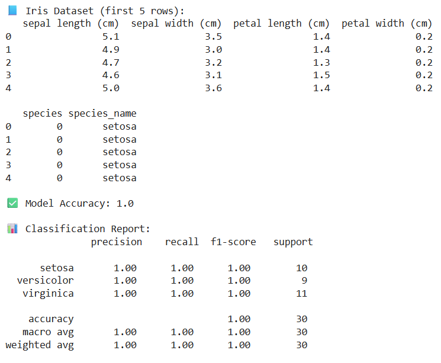
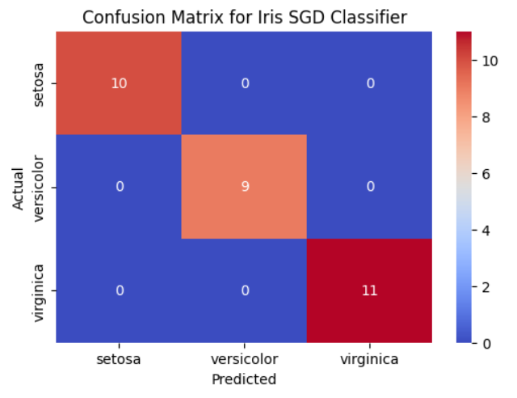
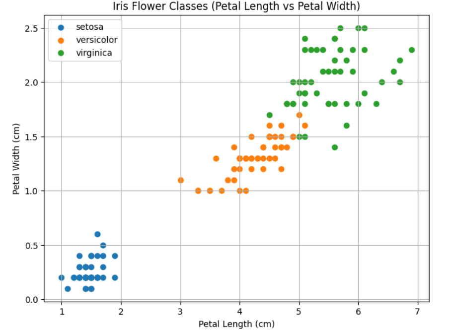

# SGD-Classifier
## AIM:
To write a program to predict the type of species of the Iris flower using the SGD Classifier.

## Equipments Required:
1. Hardware – PCs
2. Anaconda – Python 3.7 Installation / Jupyter notebook

## Algorithm
1. Import Necessary Libraries and Load Data.

2. Split Dataset into Training and Testing Sets.

3. Train the Model Using Stochastic Gradient Descent (SGD).

4. Make Predictions and Evaluate Accuracy.

5. Generate Confusion Matrix.

## Program:
```
/*
Program to implement the prediction of iris species using SGD Classifier.
Developed by: PRIYA B
RegisterNumber:  212224230208
*/
```
```
import pandas as pd
import numpy as np
import matplotlib.pyplot as plt
import seaborn as sns
from sklearn.datasets import load_iris
from sklearn.model_selection import train_test_split
from sklearn.preprocessing import StandardScaler
from sklearn.linear_model import SGDClassifier
from sklearn.metrics import accuracy_score, classification_report, confusion_matrix


iris = load_iris()


df = pd.DataFrame(data=iris.data, columns=iris.feature_names)
df['species'] = iris.target
df['species_name'] = df['species'].map({0: 'setosa', 1: 'versicolor', 2: 'virginica'})

print("📘 Iris Dataset (first 5 rows):")
print(df.head())


X = iris.data
y = iris.target


X_train, X_test, y_train, y_test = train_test_split(
    X, y, test_size=0.2, random_state=42
)


scaler = StandardScaler()
X_train = scaler.fit_transform(X_train)
X_test = scaler.transform(X_test)


sgd_clf = SGDClassifier(max_iter=1000, tol=1e-3, random_state=42)
sgd_clf.fit(X_train, y_train)


y_pred = sgd_clf.predict(X_test)


print("\n✅ Model Accuracy:", accuracy_score(y_test, y_pred))
print("\n📊 Classification Report:\n", classification_report(y_test, y_pred, target_names=iris.target_names))


cm = confusion_matrix(y_test, y_pred)


plt.figure(figsize=(6, 4))
sns.heatmap(cm, annot=True, fmt='d', cmap='coolwarm',
            xticklabels=iris.target_names, yticklabels=iris.target_names)
plt.title('Confusion Matrix for Iris SGD Classifier')
plt.xlabel('Predicted')
plt.ylabel('Actual')
plt.show()


plt.figure(figsize=(8, 6))
for i, species in enumerate(np.unique(y)):
    plt.scatter(
        df[df["species"] == i]["petal length (cm)"],
        df[df["species"] == i]["petal width (cm)"],
        label=iris.target_names[i]
    )

plt.title("Iris Flower Classes (Petal Length vs Petal Width)")
plt.xlabel("Petal Length (cm)")
plt.ylabel("Petal Width (cm)")
plt.legend()
plt.grid(True)
plt.show()


sample = [[5.1, 3.5, 1.4, 0.2]]  # Example input
sample_scaled = scaler.transform(sample)
predicted_class = sgd_clf.predict(sample_scaled)

```

## Output:

### Confusion Matrix

### Graph


## Result:
Thus, the program to implement the prediction of the Iris species using SGD Classifier is written and verified using Python programming.
